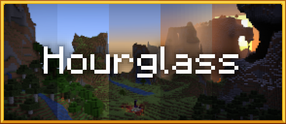

<p align="center">
	<a href="https://www.curseforge.com/minecraft/mc-mods/hourglass">
		
	</a>
</p>

<p align="center">
</p>

<p align="center">
	<a href="https://www.curseforge.com/minecraft/mc-mods/hourglass/files">
		
	</a>
	&nbsp;
	<a href="LICENSE">
		
	</a>
	&nbsp;
	<a href="https://www.curseforge.com/minecraft/mc-mods/hourglass">
		
	</a>
</p>

<p align="center">
	Hourglass is a Minecraft Forge mod that gives you control over the passage of time. It allows you to
	customize the length of the day-night cycle and alters the Minecraft sleep mechanic by accelerating
	the speed of time.
</p>

<p align="center">
Download it on <a href="https://www.curseforge.com/minecraft/mc-mods/hourglass">CurseForge</a>.
</p>

## Features

This mod (optionally) **replaces the vanilla sleep functionality with a smooth and natural transition
to morning** by accelerating the passage of time while you're in bed. In multiplayer, time will pass
faster depending on the percentage of players who are currently sleeping. This removes the need for
any sleep voting system or player threshold, as any number of players can have an impact on the
duration of the night.

Hourglass allows for **customization of the day-night cycle duration**, and can control day and night
speed independently. Rather than the vanilla duration of 20 minutes, you can slow down time to make
a day in Minecraft last as long as a day in real life, or speed up the passage of nights for a more
forgiving experience.

Hourglass also provides a number of **time effects** that may speed up the progression of various
elements in Minecraft to match the current speed of time. Some examples include crop growth, grass
growth, weather, potion effects, furnaces, hoppers, etc. Most of these time effects are disabled by
default but can be enabled by setting their associated [config options](#configuration).

## Compatibility

Hourglass is compatible with the following mods:

* [Comforts](https://www.curseforge.com/minecraft/mc-mods/comforts)
* [Serene Seasons](https://www.curseforge.com/minecraft/mc-mods/serene-seasons)
* [Enhanced Celestials](https://www.curseforge.com/minecraft/mc-mods/enhanced-celestials)
* [Quark](https://www.curseforge.com/minecraft/mc-mods/quark)  
  * The Improved Sleeping module of Quark interferes with the sleep feature of Hourglass.
    [See note below.](#sleep-vote-mods)  
  * The "Nerf Clock" Quark option breaks the bed clock in Hourglass. Either the Quark tweak should
    be disabled or the Hourglass Bed Clock should be disabled via the `displayBedClock` config.
* [Morpheus](https://www.curseforge.com/minecraft/mc-mods/morpheus)  
  * The sleep feature of Hourglass will need to be disabled to use it alongside Morpheus.
    [See note below.](#sleep-vote-mods)
* [Good Night's Sleep](https://www.curseforge.com/minecraft/mc-mods/good-nights-sleep)

#### Sleep Vote Mods

Hourglass is compatible with mods that enable sleep voting or have sleep percentage systems like
Quark and Morpheus, but they conflict with the sleep feature of this mod. These features should
either be disabled in their corresponding mods, or the sleep feature in Hourglass should be disabled.
The sleep feature can be disabled via command or file by modifying the `enableSleepFeature` option.

#### Other Compatibility Notes

The Overworld is currently the only dimension supported. However, most dimensions in Minecraft
(including custom dimensions) derive their time information from the Overworld and will therefore
elapse time at the same rate.

This mod does not save data to world files and can safely be safely removed from a Minecraft
installation.

## Commands

#### `/hourglass config <config-key> [<value>]`

Modifies or displays the current value of the specified config option.

If the `<value>` argument is omitted, this command will display the config option's current value.

Some configurations are not available through this command and need to be accessed via the config files.

#### `/hourglass query timeSpeed`

Displays the current speed at which time is elapsing.

#### `/hourglass query sleeperCount`

Displays the ratio of players sleeping in the current dimension.

## Configuration

All configuration values can be changed at runtime without reloading the game.

While many of the configuration options are accessible through via the
[config command](#hourglass-config-config-key-value), some can only be accessed by visiting the
mod's config files. Most of the options are located in the mod's
[server config file](#default-server-config) in both single-player worlds and multiplayer servers.
A few client-specific options also exist in the [client config file](#default-client-config).

Modpack developers may customize the Hourglass server settings in their modpack by first tweaking
the server settings in a test world and then moving the file to the `./defaultconfigs` folder of
their modpack. Forge will move all files in the `defaultconfigs` folder into the `serverconfig`
folder of all newly created worlds.

When customizing Hourglass, the **speed of time** is controlled using a multiplier. A value of 1 is equivalent
to vanilla speed (20 minutes for a full day-night cycle). Setting daySpeed and nightSpeed to 0.5
will cut the speed of time in half, doubling the duration of a full day to 40 minutes. Likewise,
doubling the configured speed to 2.0 will result in a shortened day lasting only 10 minutes from
one morning to the next.

> _**Warning:** Setting daySpeed and nightSpeed to values higher than 3600 may be unsafe for people with photosensitive epilepsy._

### Default Server Config

Location relative to Minecraft folder:
* Single-player worlds: `./saves/<save>/serverconfig/hourglass-server.toml`
* Multiplayer servers: `./world/serverconfig/hourglass-server.toml`

```toml
[time]
	#The speed at which time passes during the day.
	#Day is defined as any time between 23500 (middle of dawn) and 12500 (middle of dusk) the next day.
	#Vanilla speed: 1.0
	#Range: 0.0 ~ 24000.0
	daySpeed = 1.0

	#The speed at which time passes during the night.
	#Night is defined as any time between 12500 (middle of dusk) and 23500 (middle of dawn).
	#Vanilla speed: 1.0
	#Range: 0.0 ~ 24000.0
	nightSpeed = 1.0

	[time.effects]
		#When applied, this effect syncs the passage of weather with the current speed of time.
		#I.e., as time moves faster, rain stops faster. Clear weather is not affected.
		#When set to SLEEPING, this effect only applies when at least one player is sleeping in a dimension.
		#Note: This setting is not applicable if game rule doWeatherCycle is false.
		#Allowed Values: NEVER, ALWAYS, SLEEPING
		weatherEffect = "SLEEPING"

		#When applied, this effect syncs the random tick speed with the current speed of time, forcing
		#crop, tree, and grass growth to occur at baseRandomTickSpeed multiplied by the current time-speed.
		#When set to SLEEPING, randomTickSpeed is set to baseRandomTickSpeed unless at least one player is sleeping in a dimension.
		#More information on the effects of random tick speed can be found here: https://minecraft.fandom.com/wiki/Tick#Random_tick
		#WARNING: This setting overwrites the randomTickSpeed game rule. To modify the base random tick speed,
		#use the baseRandomTickSpeed setting instead of changing the game rule directly.
		#Allowed Values: NEVER, ALWAYS, SLEEPING
		randomTickEffect = "NEVER"

		#The base random tick speed used by the randomTickEffect time effect.
		#Range: > 0
		baseRandomTickSpeed = 3

		#When applied, this effect progresses potion effects to match the rate of the current time-speed.
		#This effect does not apply if time-speed is 1.0 or less.
		#THIS MAY HAVE A NEGATIVE IMPACT ON PERFORMANCE IN SERVERS WITH MANY PLAYERS.
		#When set to ALWAYS, this effect applies to all players in the dimension, day or night.
		#When set to SLEEPING, this effect only applies to players who are sleeping.
		#Allowed Values: NEVER, ALWAYS, SLEEPING
		potionEffect = "NEVER"

		#When applied, this effect progresses player hunger effects to match the rate of the current time-speed.
		#This results in faster healing when food level is full, and faster harm when food level is too low.
		#This effect does not apply if time-speed is 1.0 or less.
		#When set to ALWAYS, this effect applies to all players in the dimension, day or night. Not recommended on higher difficulty settings
		#When set to SLEEPING, this effect only applies to players who are sleeping.
		#Allowed Values: NEVER, ALWAYS, SLEEPING
		hungerEffect = "NEVER"

		#When applied, this effect progresses block entities like furnaces, hoppers, and spawners to match the rate of the current time-speed.
		#This effect does not apply if time speed is 1.0 or less.
		#When set to SLEEPING, this effect only applies when at least one player is sleeping in a dimension.
		#Allowed Values: NEVER, ALWAYS, SLEEPING
		blockEntityEffect = "NEVER"

[sleep]
	#Enables or disables the sleep feature of this mod. Enabling this setting will modify the vanilla sleep functionality
	#and may conflict with other sleep mods. If disabled, all settings in the sleep section will not apply.
	enableSleepFeature = true

	#The minimum speed at which time passes when only 1 player is sleeping in a full server.
	#Range: 0.0 ~ 24000.0
	sleepSpeedMin = 1.0

	#The maximum speed at which time passes when all players are sleeping. A value of 120
	#is approximately equal to the time it takes to sleep in vanilla.
	#Range: 0.0 ~ 24000.0
	sleepSpeedMax = 120.0

	#The speed at which time passes when all players are sleeping.
	#Set to -1 to disable this feature (sleepSpeedMax will be used when all players are sleeping).
	#Range: -1.0 ~ 24000.0
	sleepSpeedAll = -1.0

	#Set to 'true' for the weather to clear when players wake up in the morning as it does in vanilla.
	#Set to 'false' to force weather to pass naturally. Adds realism when accelerateWeather is enabled.
	#Note: This setting is ignored if game rule doWeatherCycle is false.
	clearWeatherOnWake = true

	#When true, a clock is displayed in the sleep interface.
	displayBedClock = true

	#This section defines settings for notification messages.
	#All messages support Minecraft formatting codes (https://minecraft.fandom.com/wiki/Formatting_codes).
	#All messages have variables that can be inserted using the following format: ${variableName}
	#The type option controls where the message appears:
	#	SYSTEM: Appears as a message in the chat. (e.g., "Respawn point set")
	#	GAME_INFO: Game information that appears above the hotbar (e.g., "You may not rest now, the bed is too far away").
	#The target option controls to whom the message is sent:
	#	ALL: Sends the message to all players on the server.
	#	DIMENSION: Sends the message to all players in the current dimension.
	#	SLEEPING: Sends the message to all players in the current dimension who are sleeping.
	[sleep.messages]

		#This message is sent after a sleep cycle has completed.
		[sleep.messages.morning]
			#Available variables:
			#sleepingPlayers -> the number of players in the current dimension who were sleeping.
			#totalPlayers -> the number of players in the current dimension (spectators are not counted).
			#sleepingPercentage -> the percentage of players in the current dimension who were sleeping (does not include % symbol).
			message = "§e§oTempus fugit!"
			#Sets where this message appears.
			#Allowed Values: SYSTEM, GAME_INFO
			type = "GAME_INFO"
			#Sets to whom this message is sent. A target of 'SLEEPING' will send the message to all players who just woke up.
			#Allowed Values: ALL, DIMENSION, SLEEPING
			target = "DIMENSION"

		#This message is sent when a player enters their bed.
		[sleep.messages.enterBed]
			#Available variables:
			#player -> the player who started sleeping.
			#sleepingPlayers -> the number of players in the current dimension who are sleeping.
			#totalPlayers -> the number of players in the current dimension (spectators are not counted).
			#sleepingPercentage -> the percentage of players in the current dimension who are sleeping (does not include % symbol).
			message = "${player} is now sleeping. [${sleepingPlayers}/${totalPlayers}]"
			#Sets where this message appears.
			#Allowed Values: SYSTEM, GAME_INFO
			type = "GAME_INFO"
			#Sets to whom this message is sent.
			#Allowed Values: ALL, DIMENSION, SLEEPING
			target = "DIMENSION"

		#This message is sent when a player leaves their bed (without being woken up naturally by morning).
		[sleep.messages.leaveBed]
			#Available variables:
			#player -> the player who left their bed.
			#sleepingPlayers -> the number of players in the current dimension who are sleeping.
			#totalPlayers -> the number of players in the current dimension (spectators are not counted).
			#sleepingPercentage -> the percentage of players in the current dimension who are sleeping (does not include % symbol).
			message = "${player} has left their bed. [${sleepingPlayers}/${totalPlayers}]"
			#Sets where this message appears.
			#Allowed Values: SYSTEM, GAME_INFO
			type = "GAME_INFO"
			#Sets to whom this message is sent.
			#Allowed Values: ALL, DIMENSION, SLEEPING
			target = "DIMENSION"
```

### Default Client Config

Location relative to Minecraft folder: `./config/hourglass-client.toml`

```toml
[gui]
	#Sets the screen alignment of the bed clock.
	#Allowed Values: TOP_LEFT, TOP_CENTER, TOP_RIGHT, CENTER_LEFT, CENTER_CENTER, CENTER_RIGHT, BOTTOM_LEFT, BOTTOM_CENTER, BOTTOM_RIGHT
	clockAlignment = "TOP_RIGHT"

	#This setting prevents clock wobble when getting in bed by updating the clock's position every tick.
	#As a side-effect, the clock won't wobble when first viewed as it does in vanilla. This setting is
	#unused if displayBedClock is false.
	preventClockWobble = true

	#Sets the distance between the clock and the edge of the screen.
	#Unused if clockAlignment is CENTER_CENTER.
	#Range: > 0
	clockMargin = 16

	#Sets the scale of the bed clock.
	#Range: > 1
	clockScale = 64
```
